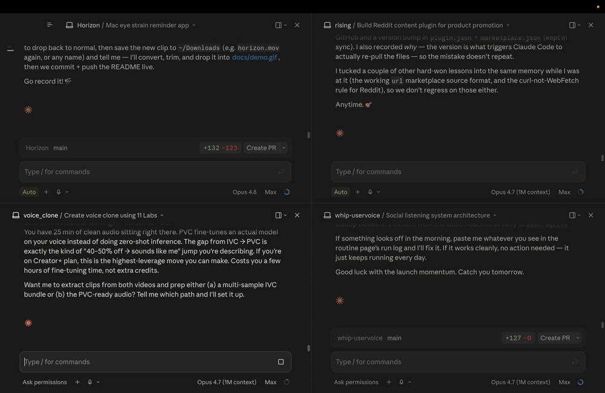

# horizon 🌅

a tiny, open-source mac app that actually makes you rest your eyes.

every 20 minutes it blacks out your screen for 20 seconds and nudges you to look about 20 feet away, then hands it right back. it's the 20-20-20 rule (what eye doctors recommend for screen strain), on autopilot.

**[download for mac →](https://github.com/agamjn/Horizon/releases/latest/download/Horizon.dmg)** · free · macOS 13+

i stare at a screen ~10 hours a day and my eyes were wrecked, so i built this. the break is a plain black screen on purpose: the whole point is to look *away* from the display, not at a pretty one. there's soft ambient sound too.

> **first launch:** horizon isn't notarized yet, so macOS says *"can't be verified."* click **Done**, then open **System Settings → Privacy & Security** and hit **Open Anyway**. just once.

### build it yourself

it's a normal xcode project, takes a minute:

- `git clone https://github.com/agamjn/Horizon.git`
- `open Horizon/Horizon.xcodeproj`
- set your signing team: the **Horizon** target → **Signing & Capabilities** → **Team** → your (free) Apple ID
- hit **⌘R**. the Horizon icon shows up in your menu bar. that's it.

### contribute

issues and PRs welcome. it's a small, heavily-commented codebase. [PLAN.md](PLAN.md) has the architecture, [TODO.md](TODO.md) the progress.

MIT © 2026 agam jain
